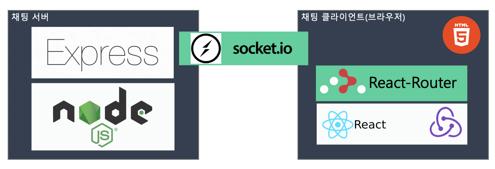
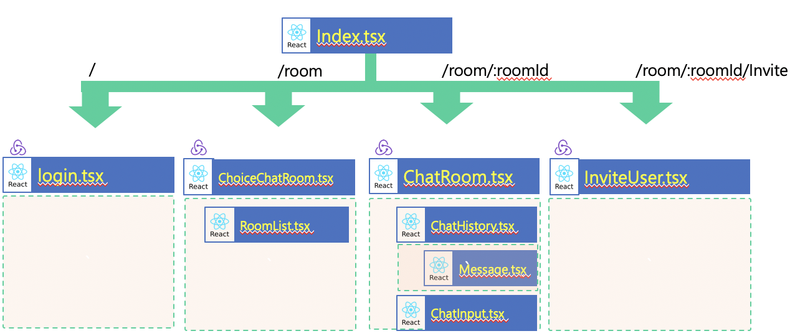

# 프론트 엔드 개발자 사전 과제


## 과제

- 채팅 어플리케이션 만들기

### 기능

- 사용자는 첫 진입 시, ID를 입력하여 접속할 수 있다.
- 채팅방 리스트에서 채팅방을 선택하여 들어갈 수 있다.
- 채팅방에 다른 사용자를 초대할 수 있다.
- 사용자는 채팅방에서 텍스트를 입력할 수 있다.
- 사용자는 채팅방에서 이미지를 입력할 수 있다.

### 과제 요구사항

- Client side rendering으로 개발
- 언어에 대한 제한은 없음
- 서버 구현 방법에 대한 제한 없음 (REST API, Long Polling, Socket...)
- 프론트엔드 구현 방법은 제한 없음 (Angular, React, Preact, Vue, jQuery...)
- UI 구현에 대한 제약은 없음
- 단위 테스트 필수, UI 테스트(Storybook, Selenium)와 통합 테스트는 선택
- README.md 파일에 문제해결 전략 및 프로젝트 빌드, 실행 방법 명시

### 예시 및 설명

- 위 언급되지 않은 내용에 대해서는 자유롭게 작성할 수 있다.

## 시스템 요구사항

해당 프로젝트를 사용하기 위해서는 아래와 같은 프로그램이 필요하다.

1. nodejs v10.16.x 또는 그 이상
2. (선택) yarn 1.16 또는 그 이상

## 사전 설치

해당 프로젝트에서 package.json 파일이 있는 디렉토리로 이동하여 다음과 같은 명령어를 실행한다.

```bash
npm install
```

## 프로젝트 통합 빌드 가이드

'사전 설치'와 마찬가지인 디렉토리에서 다음과 같은 명령어를 실행한다.

```bash
npm run build # or yarn build
```

## 프로그램 실행 가이드

이 내용은 '프로젝트 통합 빌드 가이드'를 실행 후 아래와 같은 명령을 사용하는 것을 권장한다.

```bash
npm run start # or yarn start
```

명령을 실행 후 브라우저에서 <http://localhost:4000> 으로 접속하면 해당 웹 어플리케이션을 볼 수 있다.

(단, 기존에 4000 포트를 사용하는 경우 실행이 되지 않을 수 있다.)


## 사용자 가이드

[user_guide](./user_guide/README.md) 참조

## 문제해결 전략

### 개발 환경 정의

- 개발 언어 : Typescript
- 빌드 시스템 : Webpack
- 개발 도구 : Visual Studio Code
- 사용 브라우저 : 크로미움 기반 브라우저 사용
  - [Brave](https://brave.com/)
  - Chrome
- 각 환경 별 주요 라이브러리 의존성
  - 프론트엔드 : [React](https://github.com/facebook/react)
    - [socket.io-client](https://socket.io/docs/client-api/)
    - [redux](https://github.com/reduxjs/redux)
    - [sass](https://sass-lang.com/)
    - [font-awesome](https://fontawesome.com/v4.7.0/)
  - 백엔드 : [Express.js](https://expressjs.com/ko/)
    - [socket.io](https://github.com/socketio/socket.io)
    - [socket-controllers](https://github.com/typestack/socket-controllers)
    - [routing-controllers](https://github.com/typestack/routing-controllers)
  - 테스트 : [jest](https://jestjs.io)
    - [enzyme](https://airbnb.io/enzyme/)

### 시스템 구조 설계



### Client side rendering 라우팅 설계

| URL                    | Page Description |
|------------------------|------------------|
| /#/                    | 로그인 페이지       |
| /#/room                | 채팅방 리스트 페이지  |
| /#/room/:roomId        | 채팅방 페이지       |
| /#/room/:roomId/Invite | 채팅방 초대 패아자   |

#### 잘못된 접근 라우팅 전략

모든 잘못된 접근 시 로그인 페이지로 이동

### URL 별 화면 레이어 구조 설계



### 소켓 메세지 API 설계

| Event        | Description    |
|--------------|----------------|
| Login        | 입력한 계정으로 접속|
| logout       | 로그아웃         |
| room         | 채팅방 조회       |
| room/new     | 채팅방 생성       |
| room/in      | 채팅방 진입       |
| room/out     | 채팅방 나가기      |
| room/message | 채팅방 메세지 보내기 |
| room/invite  | 채팅방 초대       |
| users        | 사용자 조회       |

[Message Payload](./docs/payload.md)

### 채팅방 메세지 이미지 / 텍스트 전송 전략

- 기본 아이디어

  - socket.io-client 라이브러리에서 ArrayBuffer와 Blob를 브라우저에서 지원

- 브라우저에서 입력 된 파일이나 텍스트 이벤트를 수신하여 소켓 메세지에 포함하여 전달

### UI 스타일 참고 사이트

<https://codepen.io/vhtkr/pen/eaLBNK>

### 프로젝트 디렉토리 구조

```bash
.
├── build                  ----> # 개발 빌드 환경 설정
│   ├── client             ----> # 웹 브라우저 개발 환경 설정
│   └── server             ----> # 서버 개발 환경 설정
├── dist
│   ├── public             ----> # 프론트엔드 배포 결과물
│   └── server             ----> # 백엔드(서버) 배포 결과물)
├── jest.config.js         ----> # 단위 테스트 환경 설정
├── package.json
├── src
│   ├── main.ts            ----> # 서버 시작 코드
│   ├── models             ----> # 서버 및 클라이언트 데이터 타입 정의
│   ├── public             ----> # 프론트엔드 개발 코드 모음
│   │   ├── components
│   │   ├── controllers    ----> # 백엔드 데이터 통신
│   │   ├── fonts
│   │   ├── index.html
│   │   ├── index.tsx      ----> # 프론트엔드 시작 스크립트
│   │   ├── pages          ----> # URL 별 화면 모음
│   │   ├── sass           ----> # 스타일 코드
│   │   ├── static         ----> # 이미지 파일 모음
│   │   └── store          ----> # 프론트엔드 데이터 저장소
│   ├── server             ----> # 서버 개발 코드 모음
│   │   ├── controllers    ----> # REST Api 및 Socket 정의
│   │   │   ├── rest
│   │   │   └── websocket
│   │   └── services       ----> # 백엔드 서비스 정의
│   │       ├── chat
│   │       └── system
│   └── test               ----> # 단위 테스트 설정 코드
├── tsconfig.json
├── tslint.json
└── user_guide             ----> # 사용자 가이트 모음
```

## 기타

### 테스트

```bash
npm run test # or yarn test
```

### 개발자용 서버 개발 가이드

```bash
npm run watch:server # or yarn watch:server
```

### 개발자용 프론트엔드 개발 가이드

```bash
npm run watch:client # or yarn watch:client
```

### 문제점

1. 동일한 브라우저로 여러 페이지를 접속 시 동작 오류가 있음

### refernce site

1. unit test

- <https://medium.com/@tejasupmanyu/setting-up-unit-tests-in-react-typescipt-with-jest-and-enzyme-56634e54703>
- <https://velopert.com/3591>
