# 웹 기반 채팅 프로그램 사용자 가이드

해당 문서는 해당 시스템에 전반적인 사용자 가이드를 제공한다.

## 웹 어플리케이션 접속

사용자는 브라우저를 열어 아래의 그림과 같이 입력하여 해당 웹 어플리케이션을 접속 할 수 있다.

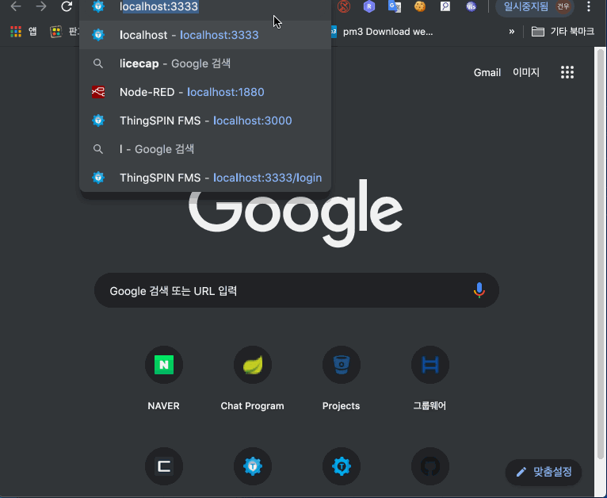

## 사용자 로그인

사용자는 중앙에 있는 입력란에 사용자 ID를 입력 할 수 있다.

사용자는 입력된 내용을 확인하고 엔터 또는 connect 버튼을 클릭하여 사용자 로그인이 되어, 채팅방 목록을 확인할 수 있다.

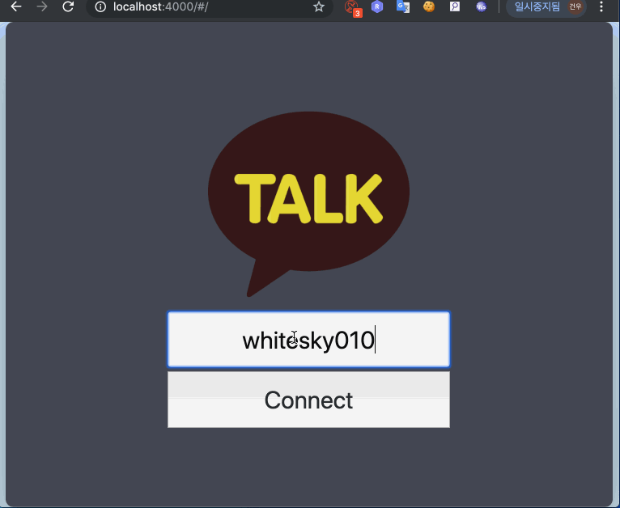

## 사용자 로그아웃

사용자는 우측 상단에 있는 아이콘을 클릭하여 사용자 로그아웃이 되며, 사용자 로그인 페이지를 보게 된다.

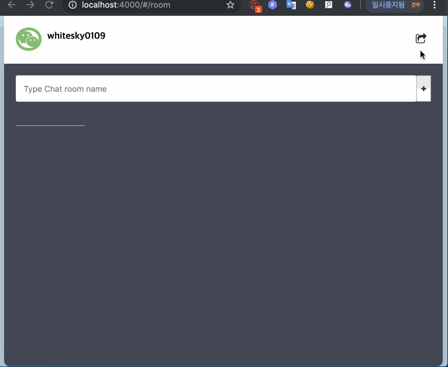

## 채팅방 만들기

사용자는 채팅방 목록 상단의 입력란에 채팅방 이름을 입력하고, 엔터 또는 우측에 버튼을 클릭하여 자신이 새로운 채팅 방을 만들 수 있다.

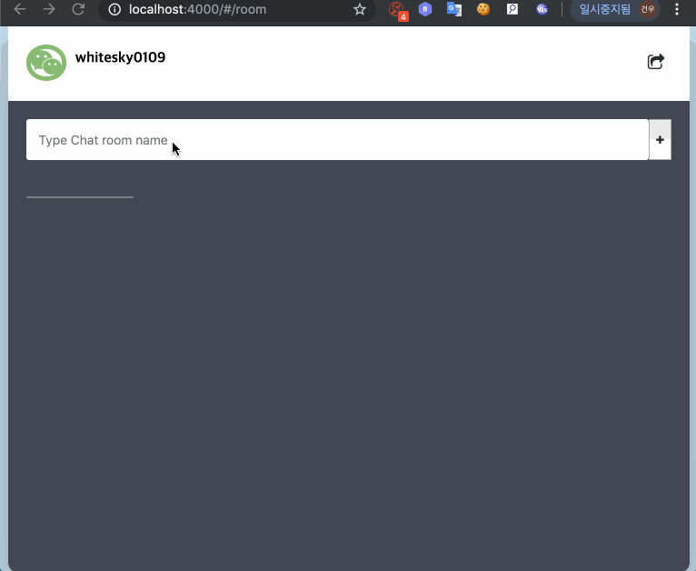

## 채팅방을 선택하여 방에 들어가기

사용자는 생성된 목록을 확인 하고, 그 중 하나의 채팅방을 선택하여 해당 채팅방으로 들어 갈 수 있다.

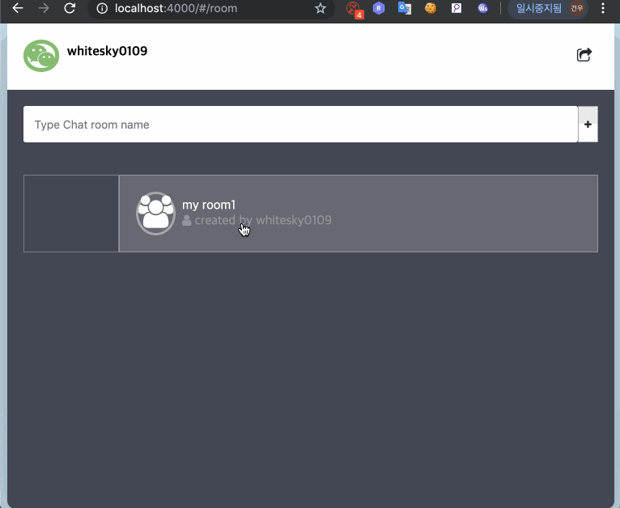

## 들아간 채팅방에서 나가기

사용자는 채팅방에서 우측 상단의 버튼을 클릭하여 채팅방을 나올 수 있다.

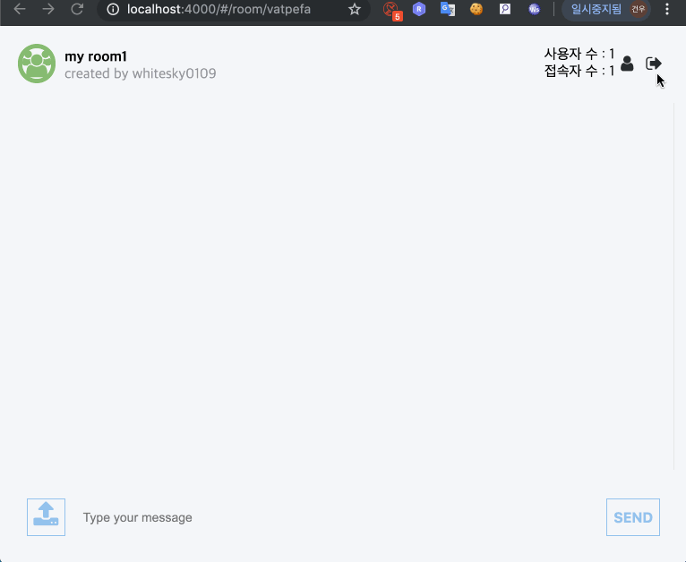

## 들어간 채팅방에서 텍스트 입력하기

사용자는 채팅방 하단의 입력란에 텍스트를 입력 할 수 있으며, 입력 후 엔터 또는 우측 버튼을 클릭하여

채팅방에 속한 사용자에게 메세지를 전달 할 수 있다.

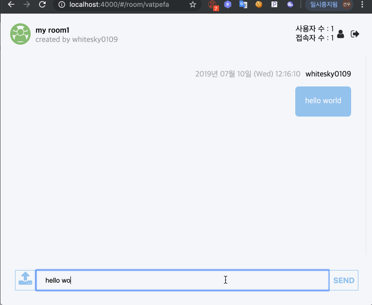

## 들어간 채팅방에서 이미지 입력하기

사용자는 채팅방 하단의 아이콘을 클릭하고 이미지 파일을 선택하여

채팅방에 속한 사용자에게 이미지 파일을 전달 할 수 있다.

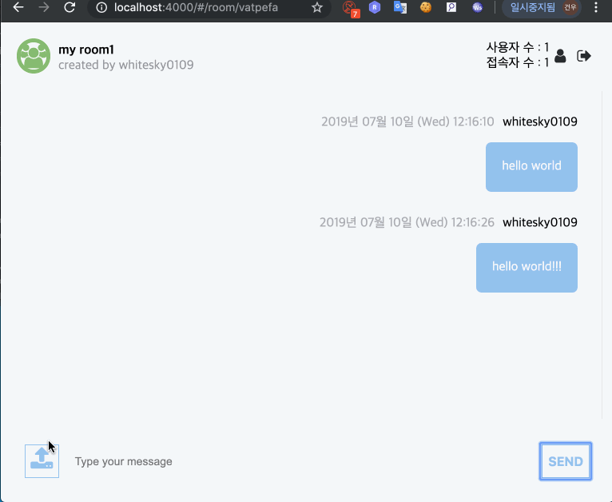

## 들아간 채팅방에서 다른 사용자 초대하기

사용자는 우측 상단의 버튼을 클릭 하여 채팅방에 다른 사용자를 초대 할 수 있는 화면을 볼 수 있다.

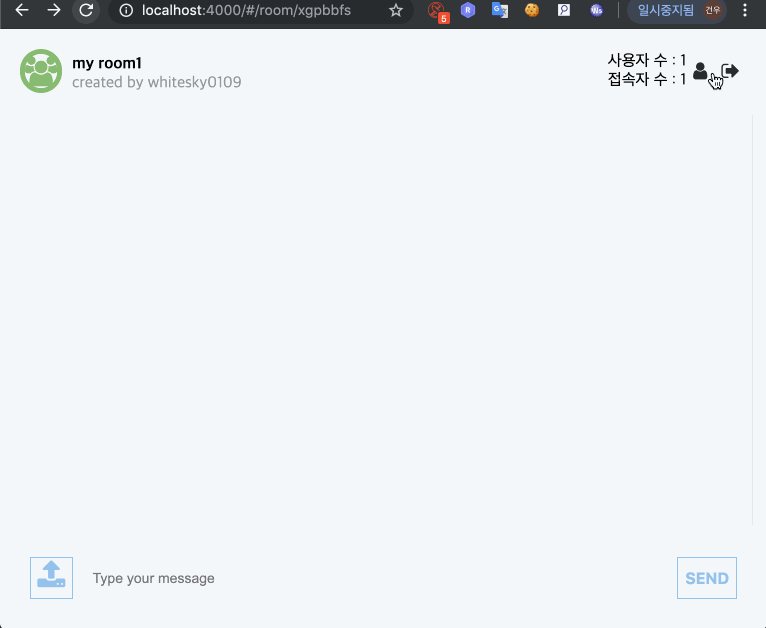

## 사용자 초대하기에서 사용자 선택하기

사용자는 등록 된 사용자 목록을 확인 할 수 있으며, 그 중 하나를 선택하여 사용자를 초대 할 수 있다.

또한, 사용자를 선택 시 이전 채팅방 화면으로 돌아간다.

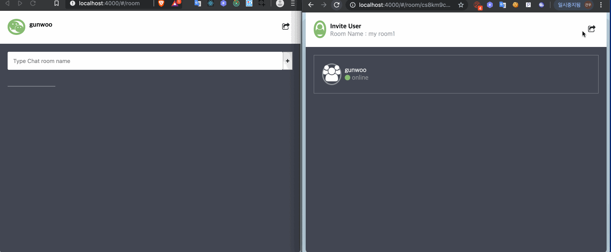

## 사용자 초대하기에서 채팅방으로 돌아가기

사용자는 우측 상단에 버튼을 클릭하여  사용자를 초대하지 않고 이전 화면으로 돌아갈 수 있다.

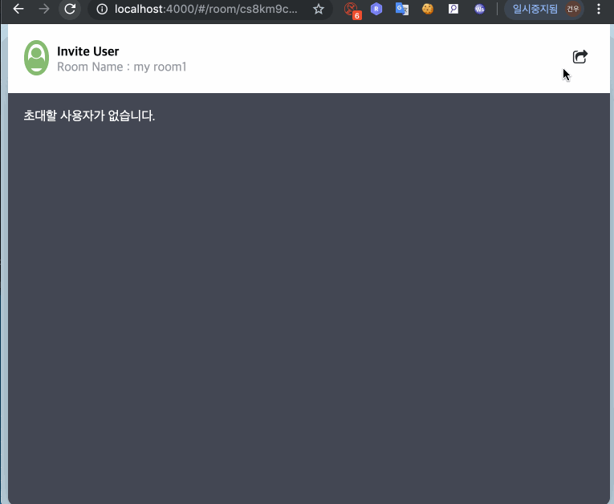

## 기타

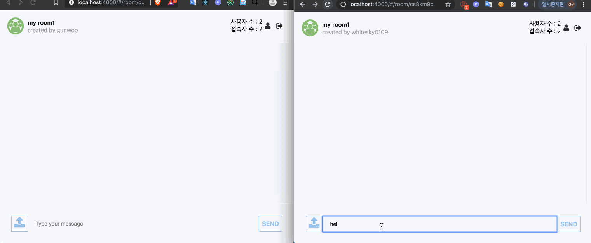

## 알려진 문제점
